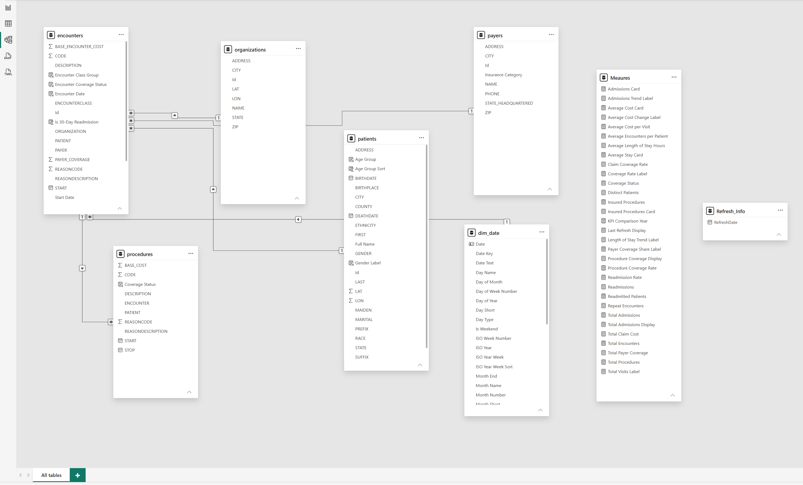
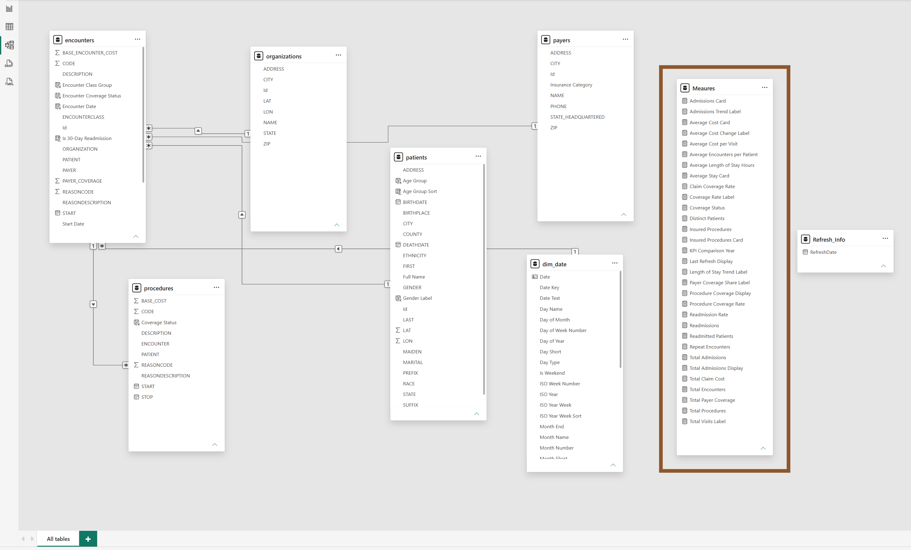

# 🏥 Hospital Financial Exposure Dashboard

Published Power BI executive dashboard for the **Maven Hospital Challenge**, focused on admissions, readmissions, length of stay, visit cost, and insurance coverage.

## 🔗 Live Project

| Resource | Link |
| --- | --- |
| 📊 Published Power BI Dashboard | [View Live Dashboard](https://app.powerbi.com/view?r=eyJrIjoiYTZmOTc5ZDQtMjQ2NS00ZTA4LTk4MTEtY2M3MThlMTI1N2NiIiwidCI6IjY3NzQ1OGU2LThjNTItNDYxMy05ZmRiLTJjYzgzN2Q1ZTRlZiJ9) |
| 🌐 Portfolio Case Study | [View Portfolio Page](https://beatricekungu.github.io/cyberattack-financial-exposure.html) |

## 📌 Project Overview

For the Maven Hospital Challenge, I acted as an **Analytics Consultant for Massachusetts General Hospital (MGH)**. The goal was to build a high-level KPI report that gives executives visibility into recent hospital performance using patient record data.

This project turns hospital data into an executive-ready Power BI dashboard by combining:

- 🧹 Power Query data preparation
- 🧠 DAX KPI measures
- 🗄️ Structured data modeling
- 📈 Executive dashboard design
- 🏥 Healthcare operations analytics
- 💰 Financial exposure and insurance coverage framing

## 🎯 Executive Questions Answered

| Executive Question | Dashboard Answer |
| --- | --- |
| **How many patients have been admitted or readmitted over time?** | The dashboard tracks patient volume and repeat visits over time. The published overview shows **974 distinct patients**, **854 repeat patients**, and an **87.7% repeat visit rate**, with yearly trend visuals for volume and readmissions. |
| **How long are patients staying in the hospital, on average?** | The model includes an **Average Length of Stay Hours** measure and trend logic to evaluate stay duration patterns across encounters and time periods. |
| **How much is the average cost per visit?** | The report uses **Average Cost per Visit**, **Average Cost Card**, and **Total Claim Cost** measures to frame financial exposure at the visit level. |
| **How many procedures are covered by insurance?** | The dashboard includes **Insured Procedures**, **Procedure Coverage Rate**, and **Coverage Status** logic to compare covered and uncovered procedures. |

## 🧱 Data Model Architecture

The model connects hospital activity across encounters, patients, procedures, payers, organizations, and date dimensions.

**Click the image to open it full-size and zoom in.**

## 🧮 Centralized DAX Measures Layer

I created a dedicated **Measures** table to centralize KPI logic for admissions, readmissions, average cost, procedure coverage, payer coverage, and patient utilization metrics.

This makes the dashboard easier to maintain, audit, and explain because the visuals rely on consistent definitions instead of scattered calculations.

**Click the image to open it full-size and zoom in.**

## 🛠️ Build Process

| Phase | What I Built |
| --- | --- |
| **1. Data Preparation** | Cleaned and shaped hospital records in Power Query for patient, encounter, procedure, payer, and date analysis. |
| **2. Data Modeling** | Connected fact and dimension tables to support trend analysis, coverage analysis, and patient-level reporting. |
| **3. KPI Development** | Built DAX measures for admissions, readmissions, cost, length of stay, coverage, encounters, and patient utilization. |
| **4. Dashboard Design** | Designed an executive report with KPI cards, trend charts, encounter mix, demographics, geography, and narrative context. |
| **5. Publication** | Published the dashboard and embedded it into my portfolio case study. |

## 📊 Key Dashboard Areas

- 👥 Patient and admission overview
- 🔁 Repeat patients and repeat visit rate
- 📅 Patient volume and readmission trends
- 🏷️ Encounter class mix
- 🧑‍🤝‍🧑 Patient demographics
- 🗺️ Patient geography
- 💵 Visit cost and claim cost exposure
- 🛡️ Insurance and procedure coverage

## 🧠 Skills Demonstrated

| Skill Area | Evidence |
| --- | --- |
| **Power BI** | Published multi-page executive dashboard |
| **Power Query** | Data preparation and reporting fields |
| **DAX** | Centralized Measures table with KPI logic |
| **Data Modeling** | Connected healthcare entities across tables |
| **Healthcare Analytics** | Patient volume, readmission, cost, and coverage analysis |
| **Executive Storytelling** | Dashboard organized around stakeholder questions |
| **Governance Thinking** | Clear metric definitions and explainable reporting logic |

## 💡 Why This Project Matters

Healthcare dashboards should do more than display charts. They should help leaders understand performance, cost, utilization, coverage, and operational risk.

This project shows my ability to move from raw data to an executive-ready reporting product that is structured, explainable, and useful for decision-making.

## 🧾 Note

This project was built from challenge/sample data for portfolio demonstration. It does **not** use confidential patient data.
