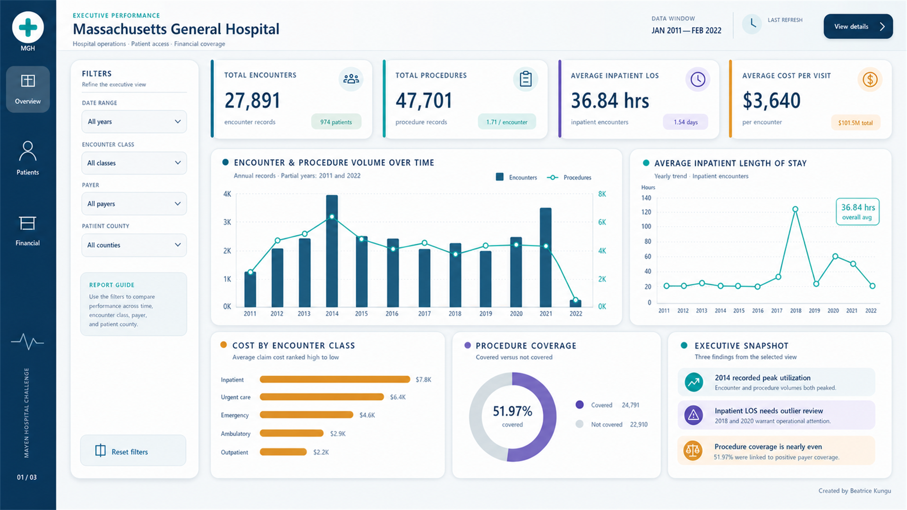
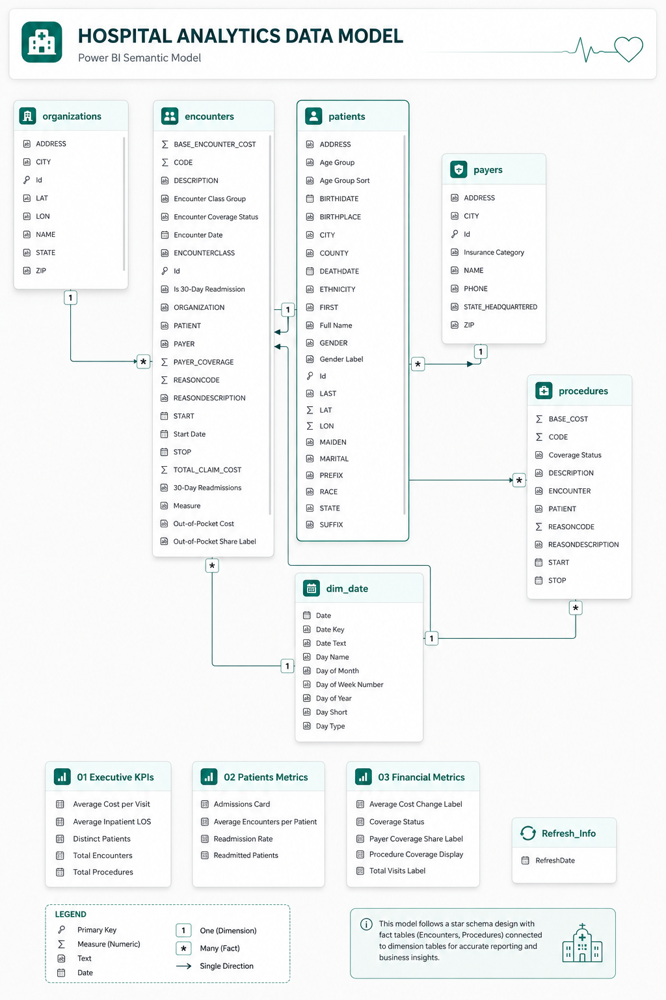

<h1 align="center">🏥 Hospital Financial Exposure Dashboard</h1>

<p align="center">
A three-page Power BI executive report that turns synthetic hospital records into decisions about utilization, patient demand, cost, payer contribution, and uncovered financial exposure.
</p>

<p align="center">
  <a href="https://app.powerbi.com/view?r=eyJrIjoiYTZmOTc5ZDQtMjQ2NS00ZTA4LTk4MTEtY2M3MThlMTI1N2NiIiwidCI6IjY3NzQ1OGU2LThjNTItNDYxMy05ZmRiLTJjYzgzN2Q1ZTRlZiJ9">
    
  </a>
  
  
  
  
</p>

<p align="center">
  <a href="https://app.powerbi.com/view?r=eyJrIjoiYTZmOTc5ZDQtMjQ2NS00ZTA4LTk4MTEtY2M3MThlMTI1N2NiIiwidCI6IjY3NzQ1OGU2LThjNTItNDYxMy05ZmRiLTJjYzgzN2Q1ZTRlZiJ9"><strong>📊 Open the interactive dashboard</strong></a>
  &nbsp;•&nbsp;
  <a href="https://mavenanalytics.io/challenges/maven-hospital-challenge"><strong>🎯 View the Maven challenge</strong></a>
</p>

---

<a href="assets/mgh-overview-preview-v3.png">
  
</a>

<p align="center"><em>Executive Overview — verified full-dataset KPIs for January 2011 through February 2022</em></p>

## 📌 Project Overview

For the **Maven Hospital Challenge**, I worked in the role of an analytics consultant supporting the executive team at Massachusetts General Hospital. The objective was to build a scalable, high-level KPI report from a subset of synthetic patient records.

I designed the solution around three stakeholder perspectives:

1. **Executive Overview** — activity, procedures, inpatient length of stay, cost, and coverage.
2. **Patient Insights** — patient volume, repeat utilization, demographics, encounter mix, and geography.
3. **Financial & Coverage** — claim cost, payer contribution, uncovered exposure, and procedure coverage.

The result is an interactive report that combines data preparation, dimensional modeling, governed DAX measures, UX design, bookmarks, navigation, and executive storytelling.

## 📊 Verified Executive Scorecard

| Metric | Full-dataset result | Why it matters |
| --- | ---: | --- |
| 🏥 **Total encounters** | **27,891** | Measures the total volume of hospital service records. |
| 📋 **Total procedures** | **47,701** | Shows the volume of clinical procedures recorded. |
| 👥 **Distinct patients** | **974** | Separates people served from the number of visits they generated. |
| 🔁 **Procedures per encounter** | **1.71** | Adds operational context to procedure volume. |
| ⏱️ **Average inpatient length of stay** | **36.84 hours / 1.54 days** | Measures stay duration only for valid inpatient encounters. |
| 💵 **Average cost per visit** | **$3,640** | Provides an encounter-level view of billed cost. |
| 🧾 **Total claim cost** | **$101.5M** | Represents total billed claim value in the sample. |
| 🛡️ **Payer coverage** | **$31.1M / 30.6%** | Quantifies the portion of billed cost attributed to payers. |
| ⚠️ **Uncovered claim exposure** | **$70.4M / 69.4%** | Shows claim cost not offset by recorded payer coverage. |
| ✅ **Covered procedures** | **24,791 / 51.97%** | Compares procedures linked to positive payer coverage with uncovered procedures. |

## 🔎 Key Findings

- 📈 **2014 recorded the highest utilization**, with encounter and procedure volumes peaking in the same period.
- 🏥 **Inpatient visits carry the highest average claim cost**, at approximately **$7.8K per encounter**.
- 🛡️ **Procedure coverage is nearly evenly divided**: 24,791 procedures were classified as covered and 22,910 as not covered.
- 💰 **Payers contributed 30.6% of total claim cost**, leaving approximately **$70.4M in uncovered claim exposure**.
- 🔁 **Repeat utilization is widespread**: 854 of 974 patients had more than one encounter in the sample. This is a repeat-utilization measure—not a formal 30-day readmission rate.

## 🧭 Report Pages

| Page | Decision focus | Main visuals |
| --- | --- | --- |
| **01 · Executive Overview** | How much activity occurred, what it cost, and how much was covered? | KPI scorecard, encounter and procedure trends, inpatient LOS trend, cost by encounter class, procedure coverage, executive findings. |
| **02 · Patient Insights** | Who was served, how often did they return, and where was demand concentrated? | Patient KPIs, repeat-utilization trend, encounter mix, age and gender distribution, county ranking, patient narrative. |
| **03 · Financial & Coverage** | What financial exposure remains after payer contribution? | Claim and payer trends, coverage by payer, cost by encounter class, procedure coverage, financial findings. |

## 🧱 Semantic Model

The model uses encounter activity as the analytical hub, with one-to-many relationships from descriptive dimensions and a one-to-many relationship from encounters to procedures.

<a href="assets/hospital-analytics-data-model.png">
  
</a>

<p align="center"><em>Power BI semantic model — fact and dimension relationships with three subject-oriented measure tables</em></p>

DAX logic is organized into three intentionally disconnected measure tables:

- `01 Executive KPIs`
- `02 Patient Metrics`
- `03 Financial Metrics`

This subject-oriented structure keeps business logic separate from source columns and makes the model easier to navigate, audit, and maintain.

## 🧮 Example DAX Logic

The inpatient length-of-stay calculation filters to inpatient records with valid start and stop timestamps before calculating the average duration in hours.

```DAX
Average Inpatient LOS =
AVERAGEX (
    FILTER (
        encounters,
        encounters[ENCOUNTERCLASS] = "inpatient"
            && NOT ISBLANK ( encounters[START] )
            && NOT ISBLANK ( encounters[STOP] )
            && encounters[STOP] >= encounters[START]
    ),
    DIVIDE (
        DATEDIFF ( encounters[START], encounters[STOP], SECOND ),
        3600
    )
)
```

The uncovered financial exposure is kept separate from payer contribution:

```DAX
Uncovered Claim Exposure =
[Total Claim Cost] - [Total Payer Coverage]
```

## 🧠 Metric Governance

Clear definitions are essential in healthcare reporting. I documented the following distinctions to prevent visually compelling—but analytically incorrect—conclusions:

| Term | Definition used in this project |
| --- | --- |
| **Encounter** | One hospital service record. It is not automatically an inpatient admission. |
| **Distinct patient** | A unique patient identifier, counted once within the selected filter context. |
| **Repeat-utilization patient** | A patient with more than one encounter in the sample or selected context. This should not be labeled a 30-day readmission without discharge-to-return logic. |
| **Average inpatient LOS** | Average elapsed time between valid inpatient encounter start and stop timestamps. |
| **Covered procedure** | A procedure linked to an encounter with positive recorded payer coverage. |
| **Uncovered claim exposure** | Total claim cost minus recorded payer coverage. It is not proof of cash actually paid by the patient. |

## 🛠️ Build Process

| Phase | Implementation |
| --- | --- |
| **1 · Data preparation** | Cleaned hospital records in Power Query, standardized data types, created reporting fields, and separated date from encounter timestamps. |
| **2 · Data modeling** | Connected patients, payers, organizations, encounters, procedures, and a dedicated date dimension using controlled relationship directions. |
| **3 · KPI development** | Built reusable DAX measures for activity, inpatient LOS, patient utilization, claim cost, payer coverage, and procedure coverage. |
| **4 · Report UX** | Designed a consistent three-page interface with executive cards, filter panels, navigation buttons, reset bookmarks, tooltips, and narrative insight panels. |
| **5 · Validation** | Reconciled card totals against source-table row counts and reviewed metric definitions to distinguish encounters, admissions, repeat visits, and formal readmissions. |
| **6 · Publication** | Published the report to Power BI Service and created a portfolio-ready GitHub case study. |

## 🎛️ Interactivity

- Filter by date, encounter class, payer, patient county, gender, age group, race, and coverage status.
- Navigate between the three report pages using the persistent sidebar.
- Reset each page to its intended default state with bookmark-driven reset controls.
- View filter-aware KPIs and trends without changing the underlying business definitions.
- See both the historical data window and the report refresh date in the header.

## 📚 Dataset

- **Source:** [Maven Analytics — Maven Hospital Challenge](https://mavenanalytics.io/challenges/maven-hospital-challenge)
- **Data type:** Synthetic hospital patient data
- **Period:** 2011–2022; the report displays January 2011 through February 2022
- **Scale:** Approximately 1,000 patients, 75,592 records, and 55 fields across multiple tables
- **Subject areas:** Patient demographics, encounters, procedures, organizations, payers, insurance coverage, cost, geography, and time

> This is a portfolio project created from synthetic challenge data. It does not contain protected health information and should not be interpreted as an official Massachusetts General Hospital report.

## ⚠️ Analytical Limitations

- The dataset is a static historical sample, not a live hospital operational system.
- The refresh date indicates when the Power BI model was refreshed; it does not extend the underlying data beyond February 2022.
- Repeat encounters do not, by themselves, establish a clinical readmission.
- Recorded payer coverage and uncovered claim exposure do not establish the final amount collected from either insurers or patients.
- Results describe this sample and should not be generalized to the current MGH patient population.

## 🧠 Skills Demonstrated

| Skill | Evidence in this project |
| --- | --- |
| **Power BI** | Published, interactive, multi-page executive report |
| **Power Query** | Data cleaning, type handling, timestamp preparation, and reporting fields |
| **DAX** | Filter-aware KPIs, ratios, display measures, and validation logic |
| **Data modeling** | Fact-and-dimension relationships, date modeling, and subject-oriented measure tables |
| **Data validation** | Reconciliation of totals and correction of admission/readmission terminology |
| **UX design** | Consistent visual hierarchy, navigation, slicers, bookmarks, and accessible color system |
| **Executive storytelling** | Findings framed around utilization, cost, coverage, and financial exposure |
| **Governance thinking** | Transparent metric definitions, limitations, and responsible interpretation |

## 💡 What This Project Demonstrates

A dashboard is credible only when its visual polish is supported by accurate definitions. This project demonstrates my ability to move from raw multi-table data to a governed semantic model and an executive-facing analytical product—while communicating both the insights and the limits of what the data can support.

---

<p align="center">
  Created by <strong>Beatrice Kungu</strong><br>
  <a href="https://github.com/beatricekungu">GitHub Profile</a>
</p>
